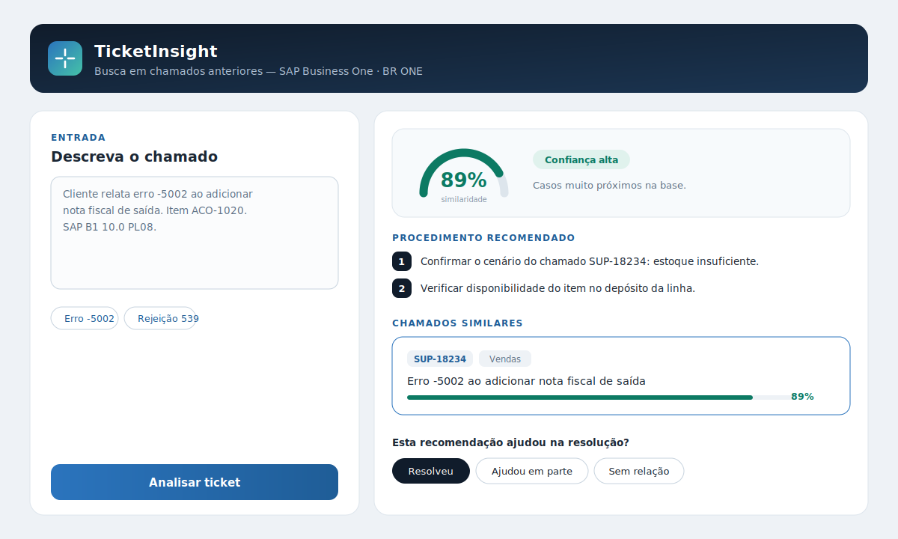

# TicketInsight

**Busca inteligente em chamados anteriores para o suporte de SAP Business One e BR ONE.**

Uma central de suporte resolve, repetidamente, os mesmos problemas — muitas vezes já solucionados antes por outro analista, mas esquecidos no histórico. O TicketInsight transforma esse histórico de chamados em uma base de conhecimento consultável: quando um chamado novo chega, o sistema encontra os casos parecidos já resolvidos e apresenta ao analista a solução aplicada antes, um procedimento sugerido e o nível de confiança da recomendação — reduzindo retrabalho e padronizando o atendimento.

O analista permanece sempre no controle: a ferramenta apoia a decisão, não a substitui.



---

## Índice

- [O problema](#o-problema)
- [Como funciona](#como-funciona)
- [Arquitetura](#arquitetura)
- [Decisões de projeto](#decisões-de-projeto)
- [Estrutura do repositório](#estrutura-do-repositório)
- [Como rodar](#como-rodar)
- [Privacidade e segurança](#privacidade-e-segurança)
- [Status e próximos passos](#status-e-próximos-passos)

---

## O problema

Chamados semelhantes chegam repetidamente à central e são distribuídos entre analistas diferentes. Quem recebe um chamado não tem visibilidade imediata de como um colega resolveu o mesmo problema antes. O resultado é retrabalho, tempo de diagnóstico gasto mais de uma vez, soluções inconsistentes e conhecimento preso na experiência individual de cada analista.

O objetivo do projeto é transformar o histórico de atendimentos em um ativo reutilizável, atacando a raiz desse desperdício.

## Como funciona

1. O analista descreve o chamado (ou, em produção, o texto chega automaticamente pelo webhook do sistema de chamados).
2. O sistema interpreta o texto e executa uma **busca híbrida** na base: similaridade semântica (embeddings) combinada com busca textual e reforço para códigos de erro literais.
3. Retorna os chamados mais parecidos já resolvidos, a solução de cada um, um procedimento recomendado, a documentação relacionada e um **nível de confiança**.
4. O analista avalia com um clique (resolveu / ajudou em parte / sem relação), e cada chamado resolvido realimenta a base, melhorando as buscas seguintes.

Quando não há nenhum caso suficientemente parecido, o sistema **se abstém** — informa que não encontrou correspondência, em vez de forçar uma sugestão duvidosa.

```
Chamado novo
     │
     ▼
Máscara de PII ──► Embedding local ──► Busca híbrida ──► Top 3 candidatos
                                          │                    │
                              (vetorial + texto + código)      ▼
                                                         Procedimento + confiança
                                                                │
                                                                ▼
                                                        Painel do analista
```

## Arquitetura

| Camada | Tecnologia |
|---|---|
| Frontend | React + Vite |
| Backend | Node.js + Express |
| Banco de dados | SQL Server |
| Embeddings | Locais, via Transformers.js (modelo `multilingual-e5-small`) |
| Busca | Híbrida: vetorial (cosseno em memória) + Full-Text Search do SQL Server + reforço de códigos, com fusão por Reciprocal Rank Fusion |
| Integração | Webhook do Movidesk para ingestão automática de chamados resolvidos |

## Decisões de projeto

Algumas escolhas que orientaram o desenvolvimento:

**Embeddings locais em vez de API externa.** Os vetores semânticos são gerados na própria infraestrutura, sem custo por requisição e sem enviar dados de clientes para fora da empresa — atendendo a requisitos de privacidade (LGPD).

**Busca híbrida, não apenas semântica.** No domínio SAP, códigos de erro literais (como `-5002` ou `ODBC -1029`) são o sinal mais forte de um chamado. A busca puramente vetorial às vezes os dilui, então ela é combinada com busca textual e um reforço dedicado a esses códigos.

**Procedimento determinístico, sem geração livre por LLM.** A recomendação é montada a partir da causa e da solução do chamado mais parecido, citando sempre o ID de origem. Isso torna a sugestão auditável e ancorada em um caso real — o sistema não inventa soluções.

**Abstenção calibrada.** Um limiar de confiança define quando o sistema deve dizer "não encontrei caso similar". Confiabilidade é priorizada sobre a aparência de sempre ter uma resposta.

## Estrutura do repositório

```
ticketinsight/
├── Backend/     API Node.js: busca híbrida, embeddings e ingestão
│   ├── server.js
│   ├── seed.js
│   ├── schema.sql
│   └── .env.example
└── frontend/    Painel do analista (React)
    └── src/App.jsx
```

## Como rodar

Pré-requisitos: Node.js 18+, uma instância de SQL Server acessível e o SQL Server Management Studio (para criar o banco).

**1. Banco de dados.** No SSMS, crie um banco (ex.: `TicketInsight`) e execute o script `Backend/schema.sql`.

**2. Backend.**
```bash
cd Backend
npm install
# copie .env.example para .env e preencha as credenciais do SQL Server
npm start        # sobe a API em http://localhost:3001
npm run seed     # popula a base com chamados de exemplo (em outro terminal)
```
No primeiro `npm start`, o modelo de embeddings (~470 MB) é baixado uma vez e fica em cache; depois disso o sistema funciona offline.

**3. Frontend.**
```bash
cd frontend
npm install
npm run dev      # abre em http://localhost:5173
```

Com os dois rodando, abra `http://localhost:5173`, clique em um exemplo e depois em "Analisar ticket".

## Privacidade e segurança

O processamento é **100% local**: os embeddings rodam na própria infraestrutura e nenhum dado de chamado é enviado a serviços externos. Há mascaramento de PII (CNPJ, CPF, e-mail, telefone) antes de indexar e de registrar feedback. Os endpoints de ingestão são protegidos por um segredo compartilhado, e credenciais ficam em um arquivo `.env` que não é versionado.

## Status e próximos passos

Prova de conceito (POC) funcional de ponta a ponta. Próximos passos previstos: calibração dos limiares de confiança com chamados reais, importação em lote do histórico existente e medição de impacto (tempo médio de atendimento e redução de retrabalho) com dados reais.
